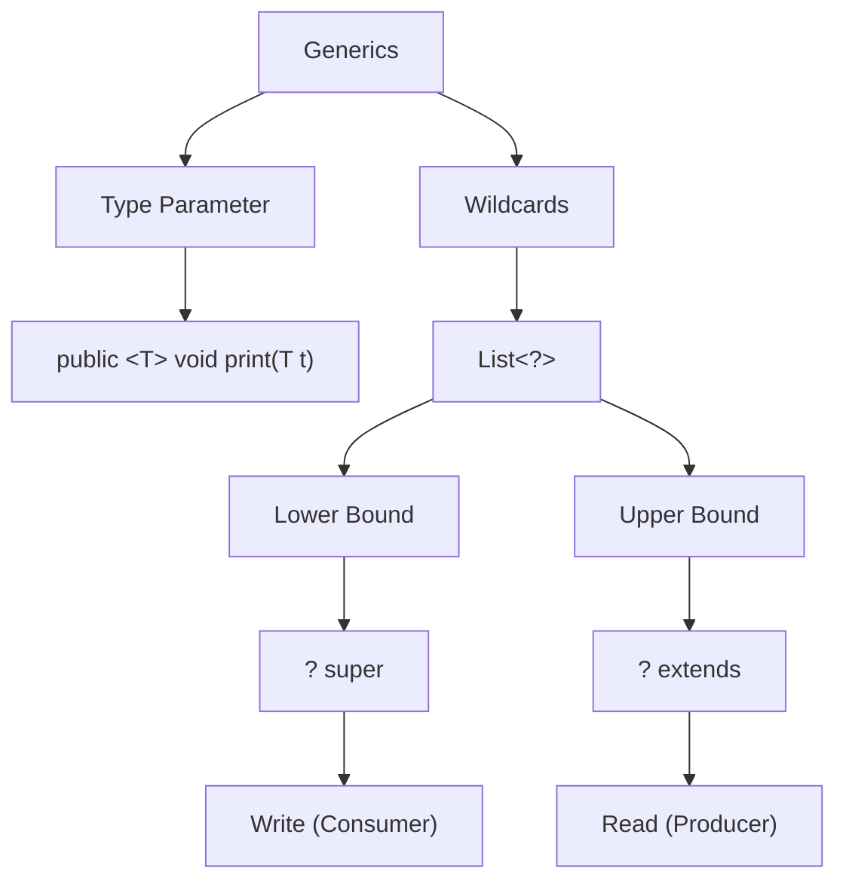

# Java
- [Pointers in Java](#pointers-in-java)
- [Generics](#generics)
- [Difference from CPP - Quick Refernce](#java-for-c-developers-quick-reference)

## Pointers in Java
- Primitive are passed by value (int, double)
- Object (Anything created with class) is passed by reference
- Can't do pointer arithmetic
- Can't pass any Object by value. See [Pass By Value](#handling-pass-by-value-for-objects-in-java) if you have to.
- GC can't take out open resources, use try-with-resource and autoCloseable to close.
- No delete keyword, GC(garbage collection) takes care of every non-reachable block of occupied memory.
- No ```->``` operator, since everything is reference, ```.``` itself works like ``->``.
- `null` instead of `NULL` or `nullptr`
- [Generics](#generics) instead of templatisation.
## Generics
- in CPP we were using `template<typenam T>` to templeatize, but Java has generics.
- <b>Generics Don't Work with Primitives</b>
  - use wrapper class (eg: Integer instead of int)
- Will never need typename keyword, just use angle brackets`< >`
- Generic type information is removed at run time due to [Type Erasure](#java-type-erasure-the-c-perspective)
  - can NOT use instanceOf with parameterized types
    - ```code 
      public <T> void create(T param) {
      T obj = new T(); // COMPILE ERROR
      }
  - can NOT create arrays of generic types
  - due to type erasure, it will only know list, not list<string> or list<int>
  - `System.out.println(str.getClass() == int.getClass()); // Returns TRUE`
  - throws error at overloading if removing the type makes function signature same.
  -  [Wild Card Type](#wild-card-types-in-generics) 
    - `?` :
    - `? extends T` :
    - `? super T` :
## Java for C++ Developers: Quick Reference

### 1. Core Runtime Differences
| Feature | C++                                                                | Java                                                                                                                                   |
| :--- |:-------------------------------------------------------------------|:---------------------------------------------------------------------------------------------------------------------------------------|
| **Compilation** | Direct to Machine Code                                             | Bytecode (.class) -> JVM                                                                                                               |
| **Memory** | Manual (new/delete/RAII - Resource Acquisition in Initialisations) | Automatic (Garbage Collection)<br/> - for resources(like db connection) you will have to close manually, try-with-resource to be used. |
| **Pointers** | Raw Pointers, Smart Pointers                                       | References Only (No Arithmetic)                                                                                                        |
| **Multiple Inheritance** | Supported (Classes)                                                | Interfaces Only (Multiple), Classes (Single)                                                                                           |

### 2. Memory Behavior
- **Stack:** Stores primitives and local reference variables.
- **Heap:** All objects (instantiated via `new`) live here.
- **Null Safety:** All object references can be `null`. Accessing them throws `NullPointerException` (NPE).

### 3. Object Model
- **All functions are methods:** No global functions. Everything must exist inside a class.
- **Virtual by default:** All non-static methods are polymorphic (like `virtual` in C++). To prevent overriding, use the `final` keyword.
- **The Root:** Every class implicitly inherits from `java.lang.Object`.

### 4. Resource Management (The RAII Alternative)
Instead of destructors, use **Try-With-Resources**:
```java
try (BufferedReader br = new BufferedReader(new FileReader(path))) {
    return br.readLine();
} // br is automatically closed here
```
### Handling "Pass by Value" for Objects in Java

#### 1. The Reality Check
- **Java is strictly Pass-by-Value.** - For primitives: The actual bit pattern is copied.
- For objects: The **reference (pointer)** is copied.
- Result: You are always operating on the original object via a copied pointer.

#### 2. Simulating C++ Pass-by-Value
Since there is no syntax like `void func(MyClass obj)`, use these patterns:

| Strategy | Implementation | C++ Equivalent |
| :--- | :--- | :--- |
| **Copy Constructor** | `public MyClass(MyClass other) { ... }` | `MyClass(const MyClass &other)` |
| **Clone Method** | Implement `Cloneable` interface (Avoid this, it is buggy) | `operator=` / Deep Copy |
| **Defensive Copy** | `void logic(Obj o) { Obj local = new Obj(o); }` | Explicit local copy |
| **Immutability** | Use `record` or `final` fields | `const` object |

#### 3. Best Practice: Records (Java 16+)
If you just need a data carrier, use a `Record`. They are immutable by design.
```java
public record User(String name, int age) {} 
// Any "change" requires creating a brand new instance.
```

### Java Type Erasure: The C++ Perspective

#### 1. The Core Concept
- **C++ Templates:** "Monomorphization" (Creates new code for every type).
- **Java Generics:** "Type Erasure" (Deletes type info, uses `Object` + Casts).

#### 2. Key Limitations (The "Gotchas")
| Feature | C++ Templates | Java Generics |
| :--- | :--- | :--- |
| **Runtime Type Info** | Available (via RTTI) | Lost (Erased to Object/Bound) |
| **Primitive Support** | Full (`vector<int>`) | None (Must use `List<Integer>`) |
| **`new T()`** | Legal | Illegal (Type unknown at runtime) |
| **Overloading** | Unique signatures | Clashes if erased types match |

#### 3. Why did Java do this?
**Backward Compatibility.** Java 5 (which introduced generics) had to run on older JVMs. By erasing types to `Object`, the new generic code remained binary-compatible with legacy "Raw Type" code.

#### 4. The "Bridge Method" Reality
If you override a generic method, the compiler secretly creates a **Bridge Method** to maintain polymorphism.
- If you see `access$000` or unexpected methods in a stack trace, it's often the compiler managing the fallout of erasure.

#### 5. Runtime Equality
```java
List<String> s = new ArrayList<>();
List<Integer> i = new ArrayList<>();
System.out.println(s.getClass() == i.getClass()); // Returns TRUE
```

### Wild Card Types in Generics


### Java Generics: Comprehensive Summary

#### 1. Core Concepts
Generics allow for **type-safe**, reusable code by catching type errors at **compile-time** and eliminating the need for explicit casting.

---

#### 2. Type Parameter (`T`) vs. Wildcard (`?`)
Based on your comparative analysis, here is the breakdown of when to use each:

| Aspect | Type Parameter (`T`) | Wildcard (`?`) |
| :--- | :--- | :--- |
| **What** | Named type placeholder  | Unknown type  |
| **Where** | Method/Class/Interface signature  | Inside method parameters only  |
| **Consistency** | Ensures same type is used across multiple variables/params | Flexible type matching; no cross-usage consistency  |
| **Usage** | Creating generic classes/methods| Accepting multiple types with flexible bounds  |
| **Example** | `public <T> void method(T t)` | `public void method(List<?> list)` |

---

### 3. Bounded Wildcards (PECS Principle)
**PECS** stands for **Producer Extends, Consumer Super**.

#### **Upper Bound: `? extends T`**
* **Meaning:** Represents type `T` or any **subtype** of `T`.
* **Role:** **Producer**.
* **Action:** **Read-only** (except for `null`).
* **Why:** The compiler doesn't know the exact subtype, so adding elements is unsafe.
* **Example:** `List<? extends Number>` can read as `Number` but cannot add `Integer` or `Double`.

#### **Lower Bound: `? super T`**
* **Meaning:** Represents type `T` or any **supertype** of `T`.
* **Role:** **Consumer**.
* **Action:** **Write-enabled** (can add elements of type `T`).
* **Why:** It is guaranteed that the list can at least hold type `T`.
* **Example:** `List<? super Integer>` can safely add `Integer` objects.

---

### 4. Key Limitations & Pitfalls
* **Primitives:** Cannot use primitives directly (e.g., use `Integer`, not `int`).
* **Instantiation:** You cannot instantiate a type parameter (`new T()`).
* **Arrays:** You cannot create generic arrays (`new T[]`).
* **Declarations:** You **cannot** use `super` in type parameter declarations (e.g., `<T super Integer>` is invalid); only `extends` is allowed there.

---

#### 5. Practical Implementation Examples

#### **Finding Max (Bounded Type Parameter)**
```java
public static <T extends Comparable<T>> T findMax(List<T> list) {
    T max = list.get(0);
    for (T element : list) {
        if (element.compareTo(max) > 0) max = element;
    }
    return max;
}